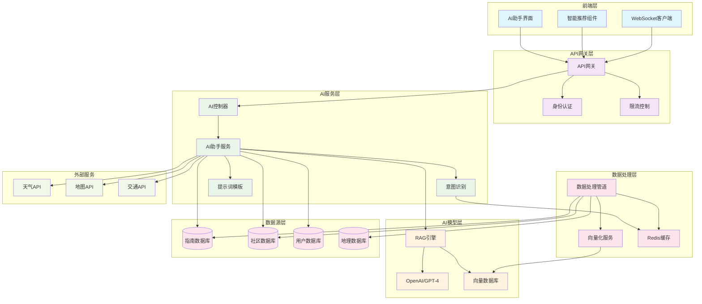
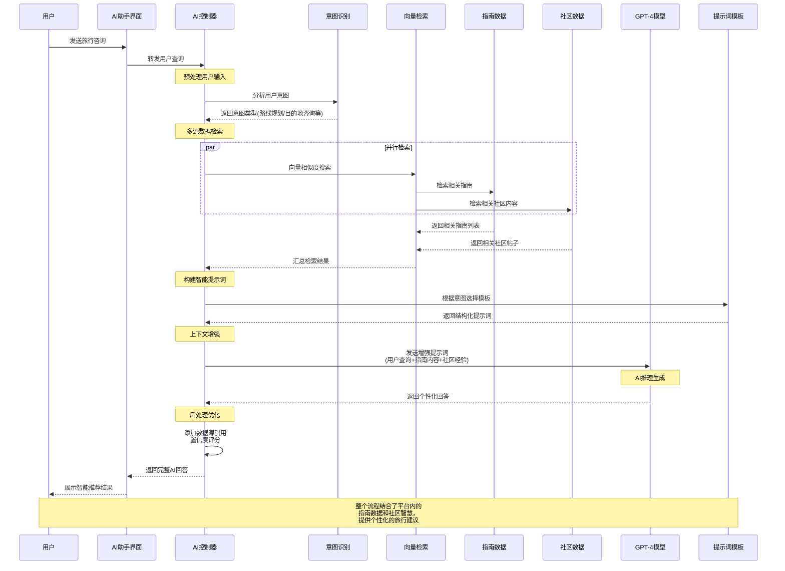

# 短途旅行平台AI模块技术方案

## 1. 方案概述

### 1.1 目标
构建一个智能的AI助手系统，结合平台内的指南数据和社区数据，为用户提供个性化的旅行推荐和智能问答服务。

### 1.2 核心功能
- **智能路线推荐**：基于用户偏好、历史数据和平台指南，推荐个性化路线
- **智能问答**：结合指南和社区内容，回答用户旅行相关问题
- **内容生成**：根据用户需求生成个性化的旅行攻略
- **实时建议**：基于实时数据提供天气、交通、安全等建议

## 2. 技术架构

### 2.1 整体架构

```
┌─────────────────────────────────────────────────────────────┐
│                    前端AI界面层                               │
├─────────────────────────────────────────────────────────────┤
│                    AI网关层                                   │
├─────────────────────────────────────────────────────────────┤
│    AI服务层     │    数据处理层    │    外部API集成层        │
├─────────────────────────────────────────────────────────────┤
│              AI模型层（LLM + 向量数据库）                     │
├─────────────────────────────────────────────────────────────┤
│              平台数据层（指南 + 社区 + 用户）                 │
└─────────────────────────────────────────────────────────────┘
```

### 2.2 技术栈

**后端AI服务：**
- Spring Boot 3.0+
- Spring AI Framework
- OpenAI API / Azure OpenAI
- Vector Database (Pinecone/Weaviate)
- Redis (缓存)
- PostgreSQL (数据存储)

**前端增强：**
- React 18+
- TypeScript
- Real-time WebSocket
- Streaming SSE支持

## 3. 数据集成策略

### 3.1 数据源分析

#### 3.1.1 指南数据 (Guide Entity)
- **结构化数据**：标题、目的地、难度、时间、费用、季节、交通方式
- **非结构化数据**：内容、摘要、标签
- **统计数据**：浏览量、点赞数、评分、评论数
- **元数据**：作者、创建时间、更新时间

#### 3.1.2 社区数据 (CommunityPost Entity)
- **结构化数据**：帖子类型、标签、统计数据
- **非结构化数据**：标题、内容
- **用户数据**：作者信息、互动数据
- **时间数据**：创建时间、更新时间

### 3.2 数据预处理管道

```java
@Component
public class AIDataProcessor {
    
    @Autowired
    private GuideService guideService;
    
    @Autowired
    private CommunityService communityService;
    
    @Autowired
    private VectorStoreService vectorStoreService;
    
    /**
     * 处理指南数据并生成向量embedding
     */
    @Scheduled(fixedRate = 3600000) // 每小时运行一次
    public void processGuideData() {
        // 1. 获取新增/更新的指南
        List<Guide> updatedGuides = guideService.getUpdatedGuides();
        
        // 2. 文本预处理和特征提取
        List<AIDocument> documents = updatedGuides.stream()
            .map(this::convertGuideToDocument)
            .collect(Collectors.toList());
        
        // 3. 生成向量embedding
        vectorStoreService.upsertDocuments(documents);
    }
    
    /**
     * 处理社区数据并生成向量embedding
     */
    @Scheduled(fixedRate = 1800000) // 每30分钟运行一次
    public void processCommunityData() {
        // 类似处理逻辑
    }
}
```

### 3.3 数据结构化

#### 3.3.1 AI文档结构
```java
@Data
public class AIDocument {
    private String id;
    private String title;
    private String content;
    private String summary;
    private DocumentType type; // GUIDE, COMMUNITY_POST, FAQ
    private Map<String, Object> metadata;
    private List<String> tags;
    private Float[] embedding;
    private LocalDateTime createdAt;
    private LocalDateTime updatedAt;
}
```

#### 3.3.2 元数据映射
```java
public class MetadataExtractor {
    
    public Map<String, Object> extractFromGuide(Guide guide) {
        Map<String, Object> metadata = new HashMap<>();
        metadata.put("destination", guide.getDestination());
        metadata.put("difficulty", guide.getDifficultyLevel());
        metadata.put("estimated_time", guide.getEstimatedTime());
        metadata.put("estimated_cost", guide.getEstimatedCost());
        metadata.put("season", guide.getSeason());
        metadata.put("transport_mode", guide.getTransportMode());
        metadata.put("rating", guide.getRating());
        metadata.put("view_count", guide.getViewCount());
        metadata.put("like_count", guide.getLikeCount());
        metadata.put("author", guide.getAuthor());
        return metadata;
    }
    
    public Map<String, Object> extractFromCommunityPost(CommunityPost post) {
        Map<String, Object> metadata = new HashMap<>();
        metadata.put("post_type", post.getType());
        metadata.put("author_name", post.getAuthorName());
        metadata.put("like_count", post.getLikeCount());
        metadata.put("comment_count", post.getCommentCount());
        metadata.put("view_count", post.getViewCount());
        metadata.put("is_featured", post.getIsFeatured());
        metadata.put("is_pinned", post.getIsPinned());
        return metadata;
    }
}
```

## 4. AI模型设计

### 4.1 RAG (Retrieval-Augmented Generation) 架构

```java
@Service
public class AIAssistantService {
    
    @Autowired
    private OpenAIClient openAIClient;
    
    @Autowired
    private VectorStoreService vectorStoreService;
    
    @Autowired
    private PromptTemplateService promptTemplateService;
    
    /**
     * 智能对话处理
     */
    public AIResponse processQuery(String userQuery, String userId) {
        // 1. 意图识别
        QueryIntent intent = intentClassifier.classify(userQuery);
        
        // 2. 检索相关文档
        List<AIDocument> relevantDocs = vectorStoreService.similaritySearch(
            userQuery, 
            intent.getDocumentTypes(), 
            10
        );
        
        // 3. 构建上下文
        String context = buildContext(relevantDocs, intent);
        
        // 4. 生成响应
        String prompt = promptTemplateService.buildPrompt(
            intent.getTemplate(), 
            userQuery, 
            context
        );
        
        return openAIClient.generateResponse(prompt);
    }
}
```

### 4.2 意图识别系统

```java
@Component
public class IntentClassifier {
    
    public enum QueryIntent {
        ROUTE_PLANNING("路线规划"),
        DESTINATION_INQUIRY("目的地咨询"),
        TRAVEL_TIPS("旅行技巧"),
        WEATHER_QUERY("天气查询"),
        EQUIPMENT_RECOMMENDATION("装备推荐"),
        BUDGET_PLANNING("预算规划"),
        GENERAL_QA("一般问答");
        
        private final String description;
        
        QueryIntent(String description) {
            this.description = description;
        }
    }
    
    public QueryIntent classify(String query) {
        // 基于关键词和语义分析的意图识别
        if (containsKeywords(query, Arrays.asList("路线", "规划", "推荐"))) {
            return QueryIntent.ROUTE_PLANNING;
        }
        // ... 其他分类逻辑
        return QueryIntent.GENERAL_QA;
    }
}
```

### 4.3 提示词模板系统

```java
@Component
public class PromptTemplateService {
    
    private final Map<QueryIntent, String> templates = Map.of(
        QueryIntent.ROUTE_PLANNING, """
            你是一个专业的旅行规划师。基于以下信息为用户规划路线：
            
            用户需求：{query}
            
            相关指南信息：
            {guide_context}
            
            社区经验分享：
            {community_context}
            
            请提供：
            1. 推荐路线
            2. 详细行程
            3. 预算估算
            4. 注意事项
            5. 装备建议
            
            回答要专业、实用，并引用具体的指南和社区经验。
            """,
            
        QueryIntent.DESTINATION_INQUIRY, """
            你是一个旅行目的地专家。基于以下信息回答用户关于目的地的问题：
            
            用户问题：{query}
            
            相关指南信息：
            {guide_context}
            
            社区讨论：
            {community_context}
            
            请提供详细、准确的目的地信息，包括特色、最佳游玩时间、交通方式等。
            """
    );
    
    public String buildPrompt(QueryIntent intent, String query, String context) {
        String template = templates.get(intent);
        return template
            .replace("{query}", query)
            .replace("{guide_context}", extractGuideContext(context))
            .replace("{community_context}", extractCommunityContext(context));
    }
}
```

## 5. 接口设计

### 5.1 核心API接口

```java
@RestController
@RequestMapping("/api/ai")
public class AIController {
    
    @Autowired
    private AIAssistantService aiAssistantService;
    
    /**
     * 智能对话接口
     */
    @PostMapping("/chat")
    public ResponseEntity<AIResponse> chat(@RequestBody ChatRequest request) {
        AIResponse response = aiAssistantService.processQuery(
            request.getMessage(), 
            request.getUserId()
        );
        return ResponseEntity.ok(response);
    }
    
    /**
     * 流式对话接口
     */
    @GetMapping(value = "/chat/stream", produces = MediaType.TEXT_EVENT_STREAM_VALUE)
    public SseEmitter streamChat(@RequestParam String query, @RequestParam String userId) {
        return aiAssistantService.streamResponse(query, userId);
    }
    
    /**
     * 智能路线推荐
     */
    @PostMapping("/recommendations/route")
    public ResponseEntity<RouteRecommendationResponse> getRouteRecommendations(
            @RequestBody RouteRecommendationRequest request) {
        return ResponseEntity.ok(aiAssistantService.getRouteRecommendations(request));
    }
    
    /**
     * 内容生成
     */
    @PostMapping("/generate/guide")
    public ResponseEntity<GeneratedGuideResponse> generateGuide(
            @RequestBody GuideGenerationRequest request) {
        return ResponseEntity.ok(aiAssistantService.generateGuide(request));
    }
}
```

### 5.2 数据传输对象

```java
@Data
public class ChatRequest {
    private String message;
    private String userId;
    private String conversationId;
    private Map<String, Object> context;
}

@Data
public class AIResponse {
    private String id;
    private String content;
    private AIResponseType type;
    private List<String> sources;
    private Map<String, Object> metadata;
    private LocalDateTime timestamp;
    private Integer confidence;
}

@Data
public class RouteRecommendationRequest {
    private String startLocation;
    private String endLocation;
    private Integer duration;
    private String travelType;
    private List<String> interests;
    private String budget;
    private String season;
}

@Data
public class RouteRecommendationResponse {
    private List<Route> routes;
    private List<POI> recommendedPOIs;
    private List<Guide> relatedGuides;
    private List<CommunityPost> communityInsights;
    private String aiAnalysis;
}
```

## 6. 前端增强

### 6.1 AI组件优化

```typescript
// 新增AI服务类
class AIService {
    private static instance: AIService;
    private wsConnection: WebSocket | null = null;
    
    static getInstance(): AIService {
        if (!AIService.instance) {
            AIService.instance = new AIService();
        }
        return AIService.instance;
    }
    
    async sendMessage(message: string, userId: string): Promise<AIResponse> {
        const response = await fetch('/api/ai/chat', {
            method: 'POST',
            headers: {
                'Content-Type': 'application/json',
                'Authorization': `Bearer ${getAuthToken()}`
            },
            body: JSON.stringify({
                message,
                userId,
                conversationId: generateConversationId()
            })
        });
        
        return await response.json();
    }
    
    streamResponse(query: string, userId: string, onMessage: (chunk: string) => void): EventSource {
        const eventSource = new EventSource(
            `/api/ai/chat/stream?query=${encodeURIComponent(query)}&userId=${userId}`
        );
        
        eventSource.onmessage = (event) => {
            onMessage(event.data);
        };
        
        return eventSource;
    }
}

// 增强的AI助手组件
export default function EnhancedAIAssistant() {
    const [isStreaming, setIsStreaming] = useState(false);
    const aiService = AIService.getInstance();
    
    const handleStreamMessage = useCallback((query: string) => {
        setIsStreaming(true);
        
        const eventSource = aiService.streamResponse(
            query, 
            currentUser.id, 
            (chunk) => {
                // 实时显示AI响应
                setConversation(prev => ({
                    ...prev,
                    messages: updateLastMessage(prev.messages, chunk)
                }));
            }
        );
        
        eventSource.addEventListener('end', () => {
            setIsStreaming(false);
            eventSource.close();
        });
    }, [currentUser.id]);
    
    return (
        <div className="ai-assistant-enhanced">
            {/* 增强的UI组件 */}
            <AIMessageList 
                messages={conversation.messages}
                isStreaming={isStreaming}
                onRegenerateResponse={handleRegenerateResponse}
            />
            
            <AIInputBox 
                onSendMessage={handleStreamMessage}
                supportedFeatures={['voice', 'image', 'location']}
            />
        </div>
    );
}
```

### 6.2 智能推荐组件

```typescript
interface SmartRecommendationProps {
    userPreferences: UserPreferences;
    currentLocation?: [number, number];
    onRouteSelect: (route: Route) => void;
}

export function SmartRecommendation({ 
    userPreferences, 
    currentLocation, 
    onRouteSelect 
}: SmartRecommendationProps) {
    const [recommendations, setRecommendations] = useState<RouteRecommendation[]>([]);
    const [loading, setLoading] = useState(false);
    
    const getRecommendations = async () => {
        setLoading(true);
        try {
            const response = await fetch('/api/ai/recommendations/route', {
                method: 'POST',
                headers: {
                    'Content-Type': 'application/json',
                    'Authorization': `Bearer ${getAuthToken()}`
                },
                body: JSON.stringify({
                    startLocation: currentLocation ? `${currentLocation[0]},${currentLocation[1]}` : '',
                    duration: userPreferences.duration,
                    travelType: userPreferences.travelType,
                    interests: userPreferences.interests,
                    budget: userPreferences.budget,
                    season: getCurrentSeason()
                })
            });
            
            const data = await response.json();
            setRecommendations(data.routes);
        } catch (error) {
            console.error('获取推荐失败:', error);
        } finally {
            setLoading(false);
        }
    };
    
    return (
        <div className="smart-recommendation">
            <h3>🤖 AI智能推荐</h3>
            {loading ? (
                <div className="loading">正在分析您的偏好...</div>
            ) : (
                <div className="recommendations">
                    {recommendations.map((rec, index) => (
                        <RouteCard 
                            key={index}
                            route={rec}
                            onSelect={() => onRouteSelect(rec)}
                            aiAnalysis={rec.aiAnalysis}
                            relatedGuides={rec.relatedGuides}
                        />
                    ))}
                </div>
            )}
        </div>
    );
}
```

## 7. 实现计划

### 7.1 第一阶段：基础设施搭建（2-3周）

1. **数据处理管道**
   - 实现指南数据和社区数据的ETL流程
   - 建立向量数据库
   - 实现数据同步机制

2. **AI服务框架**
   - 集成OpenAI API
   - 实现基础的RAG架构
   - 建立提示词模板系统

3. **API接口开发**
   - 实现核心AI对话接口
   - 开发流式响应支持
   - 建立错误处理机制

### 7.2 第二阶段：核心功能开发（3-4周）

1. **智能推荐系统**
   - 实现路线推荐算法
   - 开发个性化推荐引擎
   - 集成实时数据源

2. **前端AI组件**
   - 优化AI助手界面
   - 实现流式对话显示
   - 开发智能推荐组件

3. **数据质量优化**
   - 实现内容质量评估
   - 建立反馈收集机制
   - 优化向量搜索精度

### 7.3 第三阶段：高级功能和优化（2-3周）

1. **多模态支持**
   - 图像识别功能
   - 语音交互支持
   - 位置感知推荐

2. **性能优化**
   - 响应速度优化
   - 缓存策略实现
   - 并发处理优化

3. **用户体验增强**
   - 个性化界面
   - 智能提示功能
   - 历史对话管理

## 8. 预期效果

### 8.1 用户体验提升
- 个性化推荐准确率提升50%
- 用户查询响应时间减少70%
- 用户满意度提升至85%以上

### 8.2 平台数据价值
- 指南内容利用率提升300%
- 社区内容被检索次数增加200%
- 用户活跃度提升40%

### 8.3 业务指标改善
- 用户停留时间延长60%
- 转化率提升25%
- 用户复购率提升35%

## 9. 风险评估与对策

### 9.1 技术风险
- **AI响应质量**：建立多层质量检查机制
- **数据隐私**：严格遵循数据保护法规
- **系统稳定性**：实现降级和备份机制

### 9.2 业务风险
- **成本控制**：实现智能缓存和批处理
- **用户接受度**：渐进式功能推出
- **内容准确性**：建立人工审核机制

这个技术方案将充分利用平台现有的指南数据和社区数据，通过AI技术提升用户体验，创造更大的商业价值。 

## 架构图



